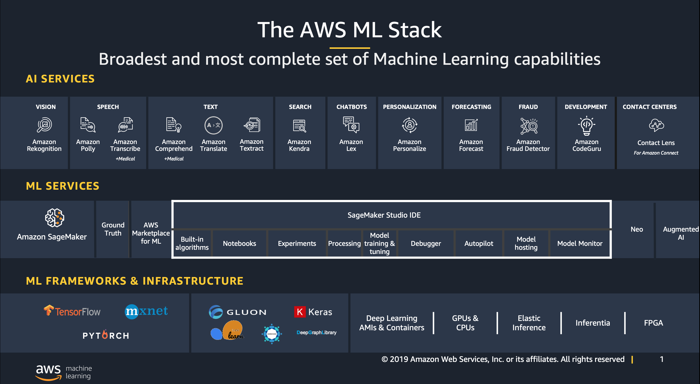
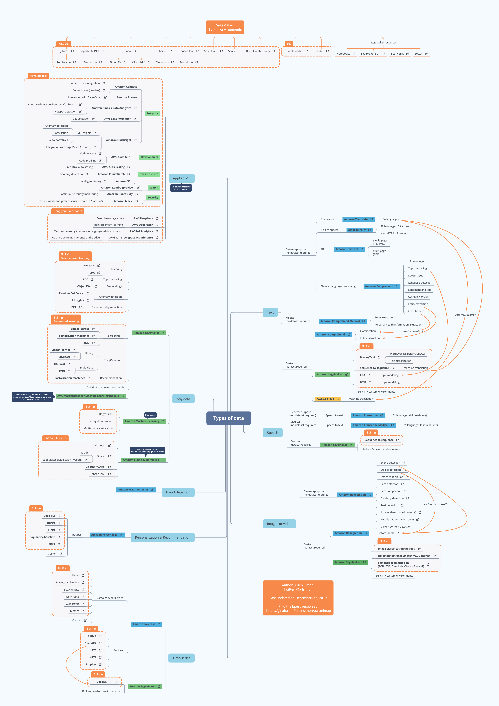
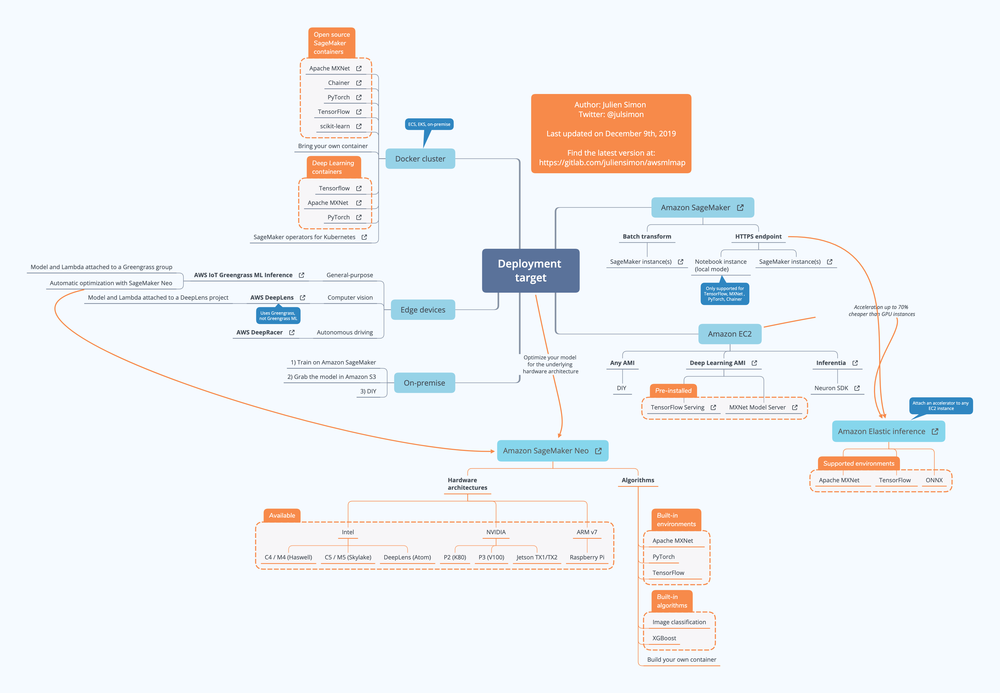

# Production Ready Machine Learning on AWS

{}
This is a very early work in progress, I would recommend investing time in other workshops like https://github.com/awslabs/amazon-sagemaker-examples, https://sagemaker-workshop.com/, https://www.sagemakerworkshop.com/, and https://www.getstartedonsagemaker.com/
{}

{}
Q. That's a lot of Sagemaker workshops above, arn't you adding to the problem by making another Sagemaker workshop?  
A. Yes, yes I am.
{}

> Building secure, reliable, and cost-optimized ML workloads on AWS

This workshop is design to get hands-on experience at every level of abstraction provided by AWS by building on top of the shoulder of giants:

- [Hands-On Machine Learning with Scikit-Learn, Keras, and Tensorflow](https://www.amazon.com/Hands-Machine-Learning-Scikit-Learn-TensorFlow/dp/1492032646)
- [Building Machine Learning Pipelines: Automating Model Life Cycles with TensorFlow](https://www.amazon.com/Building-Machine-Learning-Pipelines-Automating/dp/1492053198/)
- [Cookie Cutter Data Science](https://drivendata.github.io/cookiecutter-data-science/)
- [Amazon SageMaker](https://aws.amazon.com/sagemaker/)
- [Amazon Machine Learning Services](https://aws.amazon.com/machine-learning/)

## Objectives

The objective is to take a bottom up approach to AI/ML on AWS. We do this by building all of the components ourselves to understand at a deeper level what constructs are involved to build a production ML workload. We'll then discuss the trade-offs with having to manage everything ourselves, and what a managed platform like Sagemaker provides. After this, we'll look at all of the blood, sweat, and tears we would of saved ourselves by leveraging one of the many AI services AWS provides. To recap:

1. Build Machine Learning Services using Hardware and Compute that AWS provides
2. Move a level up to the the more managed SageMaker platform
3. Move another level up the ladder of abstraction and use AI Services

## Overview of ML on AWS

AWS has the broadest and deepest set of machine learning and AI services for business. On behalf of our customers, we are focused on solving some of the toughest challenges that hold back machine learning from being in the hands of every developer. You can choose from pre-trained AI services for computer vision, speech, language, chatbots, recommendations, and forecasting; Amazon SageMaker to quickly build, train and deploy machine learning models at scale; or build custom models with support for all the popular open-source frameworks. Our capabilities are built on the most comprehensive cloud platform, optimized for machine learning with high-performance compute, and no compromises on security and analytics.

## Resources

> All of below is an ever-growing list of resources on doing machine learning on AWS

[Julien Simon's Gitlab Repo](https://gitlab.com/juliensimon) is full of gems. Here's his high-resolution Machine Learning Map for building, training, and deploying models with AWS. A download link can be found below.

#### Building and Training Machine Learning Models:

#### Deploying Machine Learning Models:

{}